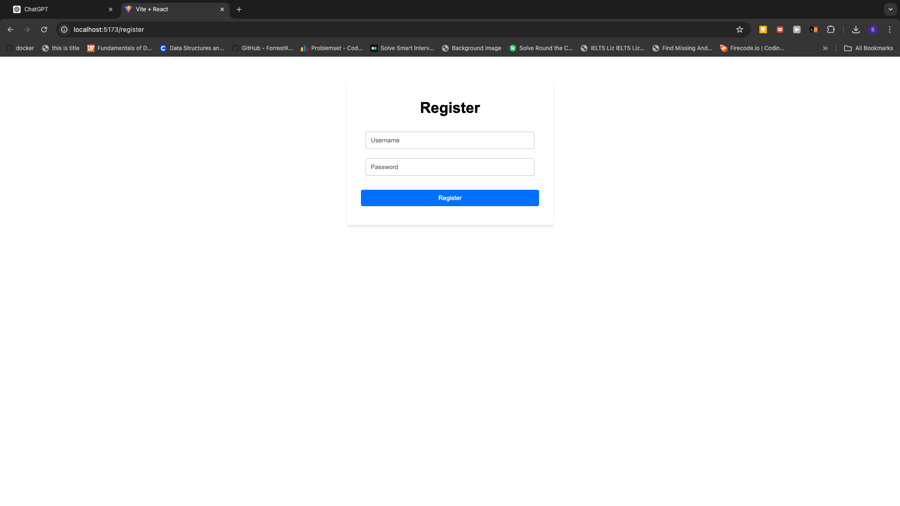
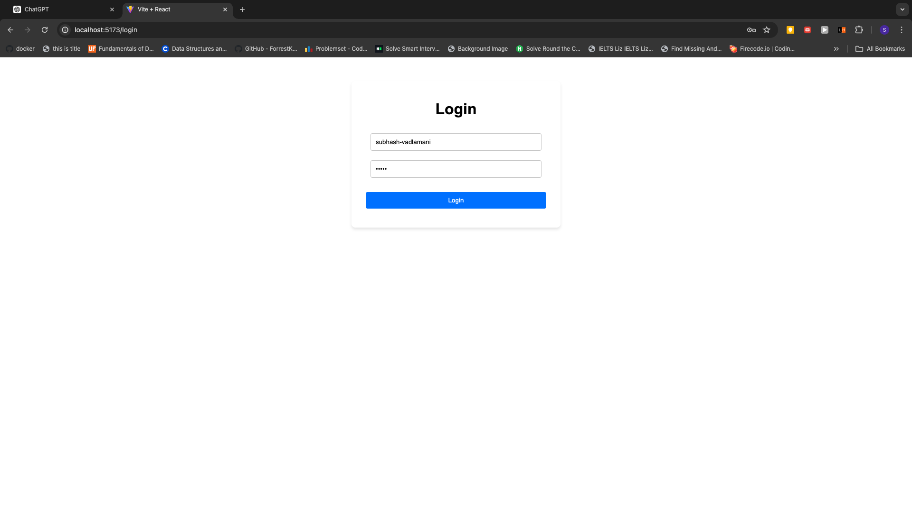
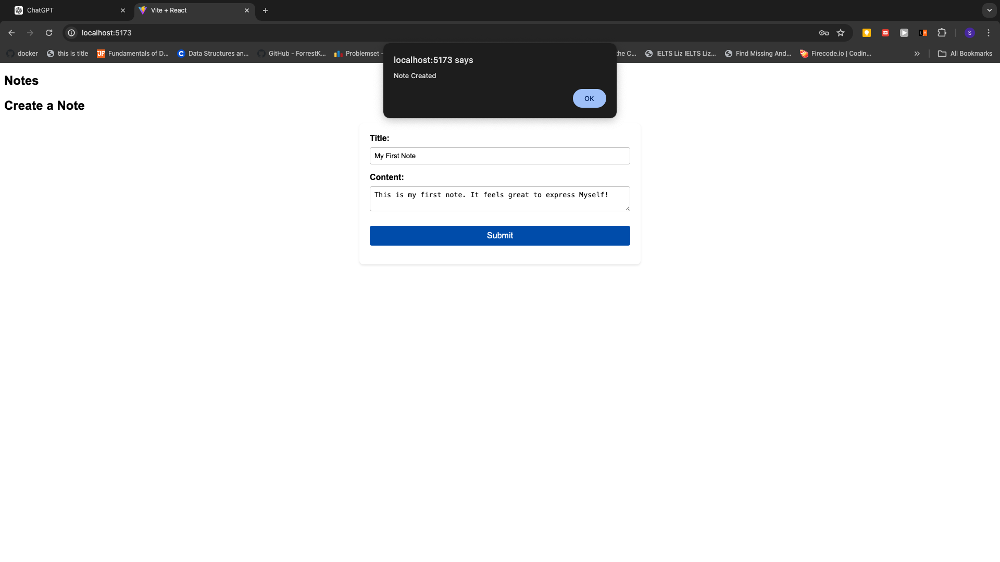
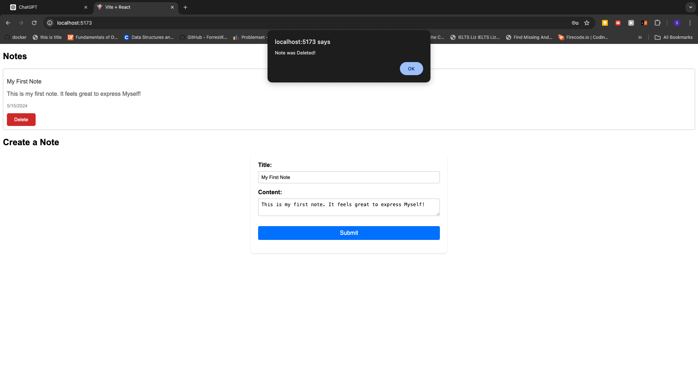

# Note Taking Application

## Description

This project is a Note Taking application using React for the front-end and Django for the backend. The software allows user registration with a username and password. After registering, users are directed to the login page where they can log in using their credentials. Authentication is handled via JWT tokens, preventing login with incorrect username or password.

Once logged in, users can view their notes in the top left corner. In the center of the page, users can enter a title and the contents of a note. After entering the details, users can submit the note by clicking the "Submit" button. An alert confirms the creation of the note, and the new note appears in the top left corner with its creation date and a "Delete" button for removing the note. Successful deletion also triggers an alert.

Logging out is done by adding `/logout` to the URL, enhancing user privacy by preventing access to content without logging in.

- _Register a User_: 
- _Login a User_: 

## Installation

1. Clone the project from the GitHub repository.
   ```bash
   git clone <repository-url>
   ```
2. Create a virtual environment and install required libraries.
   ```bash
   python -m venv venv
   source venv/bin/activate  # On Windows use `venv\Scriptsctivate`
   pip install -r requirements.txt
   ```
3. Run migrations to set up the database.
   ```bash
   python manage.py makemigrations
   python manage.py migrate
   ```
4. Start the Django backend server.
   ```bash
   python manage.py runserver
   ```
5. Ensure npm is installed and start the frontend application.
   ```bash
   npm install
   npm run dev
   ```

## Usage

- **Login/Register**: Navigate to the login and register pages to access your account.
- **Create Notes**: Enter the title and content of your note and submit.
- **Delete Notes**: Click the "Delete" button next to any note to remove it.

**Screenshots**

- _Creating a Note_: 
- _Deleting a Note_: 

## Contributing

To contribute to this project, clone the repository and send a pull request.

## Credits

Credits to "TechWithTim" on YouTube, whose tutorial was instrumental in building this project.

## Contact Information

- Email: vadlamanisubhash1998@gmail.com
